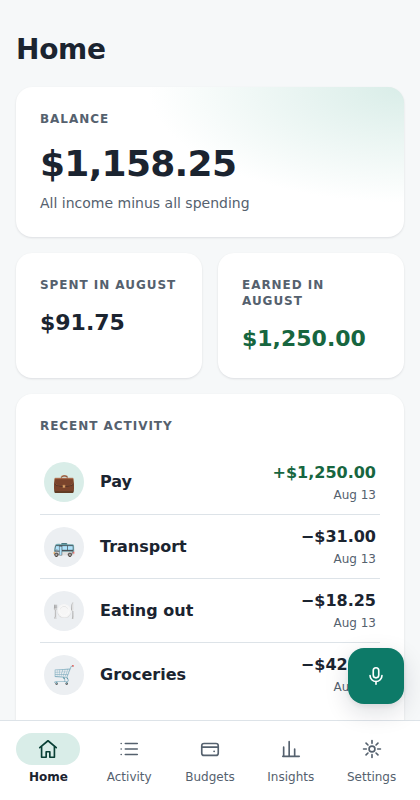
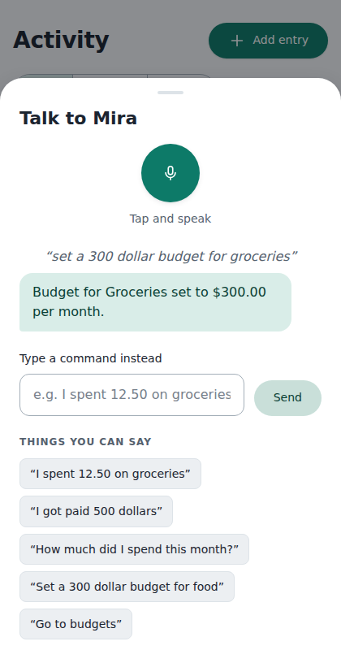
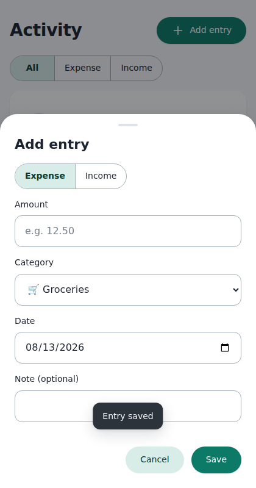
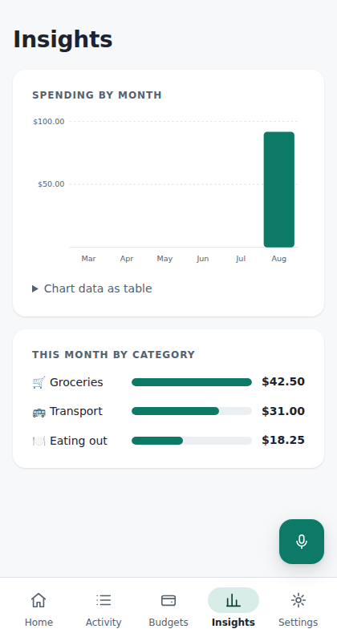
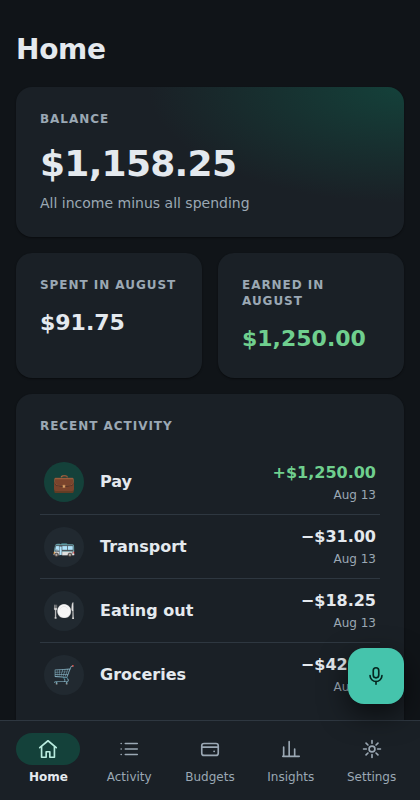
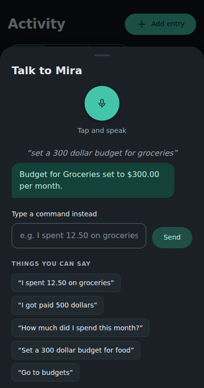
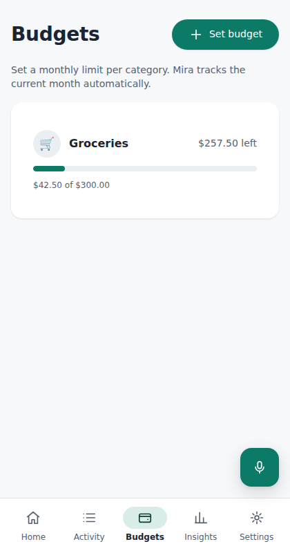
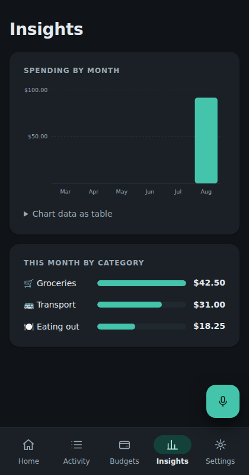

# Mira Finance

**Voice-first personal finance for underrepresented communities.**

Say *"I spent 12.50 on groceries"* — Mira records it, tells you what it heard,
and keeps everything on your device. No account, no server, no upload, ever.

| Home | Talk to Mira | Add entry | Insights |
| --- | --- | --- | --- |
|  |  |  |  |
|  |  |  |  |

The interface follows Material Design 3 component specs (navigation bar
with active-indicator pill, bottom sheets, tonal buttons, M3 type ramp)
with iOS-style large titles — in the same Mira teal palette, light and
dark.

## Why it's built this way

Mira is designed for people who are poorly served by mainstream finance apps:
people who distrust data collection for good reasons, who find dense forms
hostile, who speak Spanish at home, or who share devices.

Those users shaped every architectural decision:

- **Local-first, no backend.** All data lives in the browser's IndexedDB.
  There is nothing to sign up for and nowhere for data to leak. The
  production Content-Security-Policy allows connections only to `'self'`,
  so any network request is a policy violation by construction.
- **Voice is first-class, never mandatory.** Speech recognition and
  synthesis use the browser's Web Speech API — no cloud NLP, no API keys.
  Every voice flow has an equivalent manual flow, and browsers without
  microphone support get a typed-command fallback with the same grammar.
- **Deterministic language understanding.** A unit-tested parser maps
  transcripts to typed intents in English and Spanish, including spoken
  numbers ("three hundred fifty", "trescientos cincuenta"). Ambiguous
  input is never guessed into a money action — it becomes a request to
  rephrase.
- **Money is integer cents.** No floating-point currency math anywhere.
- **Bilingual and accessible by default.** English/Spanish with
  compiler-enforced catalog parity, full keyboard operation, screen-reader
  landmarks and labels, focus-trapped dialogs, chart data tables, and
  `prefers-reduced-motion`/dark-mode support.
- **Installable and offline.** A dependency-free service worker caches the
  shell; the app works without a connection because it never needed one.

## What you can say

| English | Español |
| --- | --- |
| "I spent 12.50 on groceries" | «Gasté 12.50 en comida» |
| "I got paid 500 dollars" | «Me pagaron 500 pesos» |
| "How much did I spend this month?" | «¿Cuánto gasté este mes?» |
| "What's my balance?" | «¿Cuál es mi saldo?» |
| "Set a 300 dollar budget for food" | «Pon un presupuesto de 300 para comida» |
| "Go to budgets" | «Ve a presupuestos» |

## Architecture

```
src/
├── domain/     Pure TypeScript core: money (integer cents), dates,
│               categories, validation, aggregation. No React, no I/O.
├── storage/    IndexedDB persistence: versioned schema, typed Repository,
│               corruption-tolerant reads, JSON export.
├── store/      React context + reducer over the Repository; optimistic
│               writes with rollback; undoable deletes.
├── voice/      Intent types, bilingual lexicon + deterministic parser,
│               spoken-number parsing, Web Speech API wrappers.
├── i18n/       Typed translation catalogs (en/es) + Intl formatting.
├── ui/         Design-system primitives: tokens, Button, Card, Field,
│               Dialog (focus trap), Toast, Segmented.
└── app/        Shell, hash router, pages, charts, voice assistant.
```

Dependencies are deliberately minimal (React + React DOM at runtime; no
router, state, chart, or i18n libraries) — every dependency Mira avoids is
one its users don't have to trust.

## Development

```bash
npm install
npm run dev            # dev server
npm test               # 165 tests (Vitest + Testing Library + fake-indexeddb)
npm run lint           # ESLint (typescript-eslint, react-hooks)
npm run build          # type-check + production build with CSP injection
npm run preview        # serve the production build
```

The improvement plan this codebase was built against, including audit notes
and deliberate scope exclusions, is in
[`docs/IMPROVEMENT_PLAN.md`](docs/IMPROVEMENT_PLAN.md).

## Privacy commitments

- Your data never leaves the device. There is no telemetry of any kind.
- **Download my data** (Settings) exports everything as versioned JSON.
- **Erase all data** (Settings) permanently deletes everything, behind an
  explicit confirmation.
